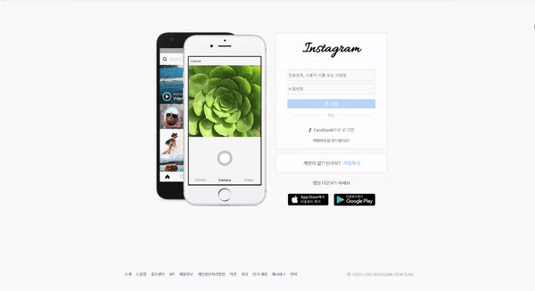
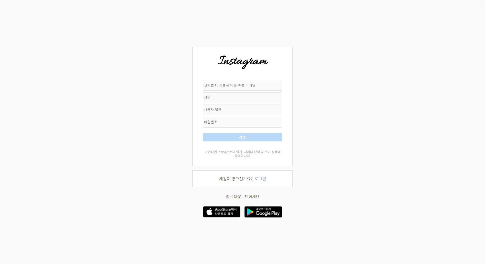

```
  ____  _
 / ___|| |  ___   _ __    ___
| |    | | / _ \ | '_ \  / _ \
| |___ | || (_) || | | ||  __/
 \____||_| \___/ |_| |_| \___|
  ___              _
|_ _| _ __   ___ | |_   __ _   __ _  _ __   __ _  _ __ ___
 | | | '_ \ / __|| __| / _` | / _` || '__| / _` || '_ ` _ \
 | | | | | |\__ \| |_ | (_| || (_| || |   | (_| || | | | | |
|___||_| |_||___/ \__| \__,_| \__, ||_|    \__,_||_| |_| |_|
                              |___/

```

### ToDoList

  - [x] ~~로그인 UI 구현~~  <small>*2020/08/24*</small>
  - [x] ~~회원가입 UI 구현~~ <small>*2020/08/24*</small>
  - [x] ~~게시글 UI 구현~~  <small>*2020/08/31*</small>
  - [x] ~~로그인 / 회원가입 쿠키-세션을 이용한 기능 구현~~ <small>*2020/09/10*</small>
  - [x] ~~게시글 이미지 불러오기~~ <small>*2020/09/11*</small>
  - [x] ~~팔로잉한 사람들의 게시물 불러오기~~ <small>*2020/09/11*</small>
  - [x] ~~게시물에 들어갈 ID / Content 불러오기~~ <small>*2020/09/11*</small>
  - [x] ~~게시물 업로드 구현~~ <small>*2020/09/11*</small>
  - [ ] 팔로우/팔로워 기능 
  - [x] ~~게시글 삭제~~ <small>*2020/09/11*</small>
  - [ ] 댓글 CRUD


1. DB
   - 테이블 종류
   ```
   +---------------------+
   | Tables_in_instagram |
   +---------------------+
   | post                |
   | post_comment        |
   | post_content        |
   | post_image          |
   | post_likes          |
   | user                |
   +---------------------+
   ```

   - post 테이블 - 게시글 내용 저장 (user id로 연결)
   ```
   +-------------+-------------+------+-----+-------------------+-------------------+
   | Field       | Type        | Null | Key | Default           | Extra             |
   +-------------+-------------+------+-----+-------------------+-------------------+
   | post_id     | int         | NO   | PRI | NULL              | auto_increment    |
   | id          | varchar(20) | NO   |     | NULL              |                   |
   | upload_date | datetime    | NO   |     | CURRENT_TIMESTAMP | DEFAULT_GENERATED |
   | nickname    | varchar(20) | NO   |     | NULL              |                   |
   +-------------+-------------+------+-----+-------------------+-------------------+
   ```

   - post_comment 테이블 - post_id로 post별 댓글 저장
   ```
   +-----------------+--------------+------+-----+---------+-------+
   | Field           | Type         | Null | Key | Default | Extra |
   +-----------------+--------------+------+-----+---------+-------+
   | post_id         | int          | NO   |     | NULL    |       |
   | comment_comtent | varchar(128) | NO   |     | NULL    |       |
   | upload_date     | datetime     | NO   |     | NULL    |       |
   +-----------------+--------------+------+-----+---------+-------+
   ```

   - post_content 테이블 - post_id로 post별 본문 저장
   ```
   +---------+------+------+-----+---------+-------+
   | Field   | Type | Null | Key | Default | Extra |
   +---------+------+------+-----+---------+-------+
   | post_id | int  | NO   |     | NULL    |       |
   | content | text | NO   |     | NULL    |       |
   +---------+------+------+-----+---------+-------+
   ```
   
   - post_image 테이블 - post_id로 post별 본문 이미지 저장
   ```
   +------------+-------------+------+-----+---------+-------+
   | Field      | Type        | Null | Key | Default | Extra |
   +------------+-------------+------+-----+---------+-------+
   | post_id    | int         | NO   |     | NULL    |       |
   | image_link | varchar(20) | NO   |     | NULL    |       |
   +------------+-------------+------+-----+---------+-------+
   ```
   
   - post_likes 테이블 - post_id로 post별 좋아요한 아이디 저장
   ```
   +----------+-------------+------+-----+---------+-------+
   | Field    | Type        | Null | Key | Default | Extra |
   +----------+-------------+------+-----+---------+-------+
   | post_id  | int         | NO   |     | NULL    |       |
   | likes_id | varchar(20) | NO   |     | NULL    |       |
   +----------+-------------+------+-----+---------+-------+
   ```

   - user 테이블 - 유저 개인정보
   ```
   +----------+-------------+------+-----+---------+-------+
   | Field    | Type        | Null | Key | Default | Extra |
   +----------+-------------+------+-----+---------+-------+
   | id       | varchar(20) | NO   | PRI | NULL    |       |
   | password | varchar(20) | NO   |     | NULL    |       |
   | nickname | varchar(20) | NO   |     | NULL    |       |
   | name     | varchar(20) | NO   |     | NULL    |       |
   +----------+-------------+------+-----+---------+-------+
   ```

2. 메인 페이지

  

3. 로그인 페이지

  

4. 회원가입 페이지

  

5. JS

 - Front (AJAX - axios API)

```javascript
const login = await axios.post('/login', { id, password }); // axios API를 이용 / async-await을 활용하여 비동기 환경에서 동기처리
```

 - Back (express + mysql)

```javascript
app.use(session({ // 로그인 시 세션을 파일로 저장
  secret: '', 
  resave: false, 
  saveUninitialized: true,
  store: new FileStore(),
}));

const db = mysql.createConnection({ // mysql 모듈을 이용하여 DB사용
  hosts: 'localhost',
  user: '',
  password: '',
  database: 'instagram'
}); // DB연결

app.use(express.static('public')); // express를 이용한 public내에 있는 정적파일 접근

app.get('/main', async (req, res, next)=>{ // express 라우터와 미들웨어를 활용하여 서버 구현 
  try{
    if(req.session.idname){
      const data = await fs.readFile('./public/html/main.html');
      return res.end(data);
    } else{
      res.redirect('/');
    }
  } catch(err) {
    console.error(err);
    res.redirect('/')
  }
});

```
### 게시글 구현
 - 게시글을 불러올 때 post index를 내림차순으로 불러와서 최신순으로 정렬한다.
 - 게시글의 이미지 저장 방식은 multer 미들웨어를 사용하여 각 게시글 index 와 대응 되는 폴더에 이미지를 저장하고 Read할 때 폴더에서 이미지를 읽어온다.
 - 게시글 삭제는 각 게시글 별로 id와 index를 부여하여 해당 게시글의 삭제 버튼을 클릭 했을때 id와 index를 axios로 서버로 보내고 데이터베이스와 폴더 그 안에 이미지를 삭제한다.
 - 게시글은 팔로워한 사람들을 포함하여 등록된 게시글을 동적으로 생성하고 생성된 게시글에 각각의 데이터를 반영한다.
